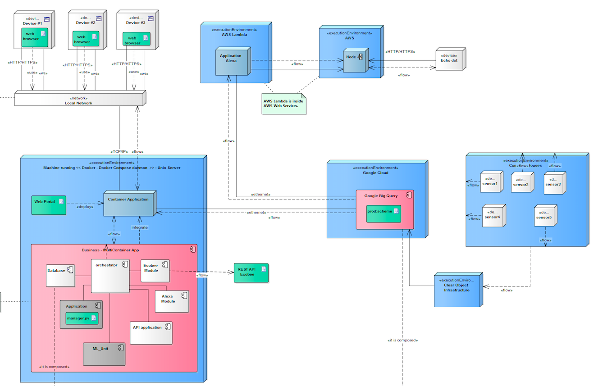

Happearth WEB
====================
This project provides a way to visualize data related of devices data consume energy in houses. 
In especify was develop in the  Research Center for Open and Digital Innovation in one of his research projects.

<a href="https://play.google.com/store/apps/details?id=me.danieldev.happearth" align="center">
  
</a> 

Video Demos
---------
  * [Walkthrough Normal User](https://www.youtube.com/watch?v=siDfX1V4jSY&list=PL2Adzu29QFW7e-ttRDT6EJDtKi215Ngkb&index=1)
  * [Walkthrough Admin User](https://www.youtube.com/watch?v=CWdd_COiLT0&list=PL2Adzu29QFW7e-ttRDT6EJDtKi215Ngkb&index=2)
  * [Walkthrough App Android](https://www.youtube.com/watch?v=n7ys87E8FRs&list=PL2Adzu29QFW7e-ttRDT6EJDtKi215Ngkb&index=3)
  * [Feature Control with speech](https://www.youtube.com/watch?v=yTx8MR5NCJs&list=PL2Adzu29QFW7e-ttRDT6EJDtKi215Ngkb&index=5)  
  * [Feature Alexa](https://www.youtube.com/watch?v=f5FYRmnlgf4&list=PL2Adzu29QFW7e-ttRDT6EJDtKi215Ngkb&index=4)  

Installing
----------
There are three different ways to deploy the application in the server, see below the details.

#### Docker Compose 
```sh
  $ git clone https://github.com/xdanielsb/HappearthWeb.git repo/ && cd repo/  
  $ docker-compose build
  $ docker-compose up -d

  # Do you want to distribute the network traffic across multiple instances? LOAD BALANCING = <3 
  $ docker-compose scale app=NUM_SERVERS_YOU_WANT

  # Now open the browser in localhost:8080
```

#### Virtual env
```sh
  $ git clone https://github.com/xdanielsb/HappearthWeb.git repo/ && cd repo/
  $ virtualenv ~/happearth --python `which python3.6`
  $ source ~/happearth/bin/activate 
  $ pip install -r requirements.txt
  $ python manage.py runserver 

  # Now open the browser in localhost:8000
```

### TroubleShooting Videos
  * [Docker Walkthrough Installing](https://www.youtube.com/watch?v=21nelITwbRs&list=PL2Adzu29QFW7e-ttRDT6EJDtKi215Ngkb&index=6)  
  * [Virtualenv Walkthrough Installing](https://www.youtube.com/watch?v=_Cs-qPv-NhE&list=PL2Adzu29QFW7e-ttRDT6EJDtKi215Ngkb&index=7)  


<p style="font-size=7">
Note: if you are running in not secure mode change to debug mode. 
</p>

Architecture Application
------------------------
<p align="center">
    
</p>

Developer
----------
* Name : Daniel Santos
* Email : dfsantosbu@unal.edu.co

License
-------

This project is licensed under the GPL V3 License - see the [LICENSE](LICENSE) file for details

